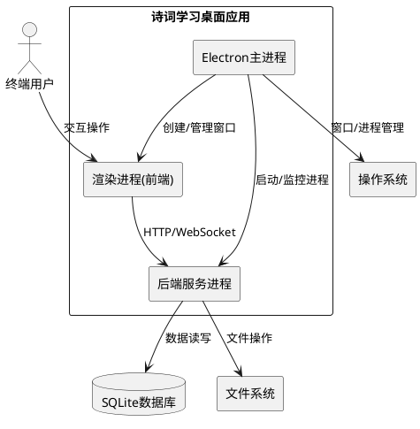

# **1. 实现模型**

## **1.1 上下文视图**



## **1.2 服务/组件总体架构**

### 架构层次

```
┌─────────────────────────────────────────────────────────────┐
│                    Electron 应用层                           │
├─────────────────────────────────────────────────────────────┤
│  ┌─────────────────┐  ┌─────────────────────────────────┐   │
│  │   主进程 (Main)   │  │      渲染进程 (Renderer)        │   │
│  │                 │  │                                 │   │
│  │  - 窗口管理      │  │  - Vue 3 前端应用               │   │
│  │  - 进程管理      │  │  - ECharts 图表                 │   │
│  │  - 后端启动      │  │  - Socket.io Client            │   │
│  │  - 路径处理      │  │  - 自定义标题栏                 │   │
│  │                 │  │                                 │   │
│  └────────┬────────┘  └───────────────┬─────────────────┘   │
│           │                           │                     │
│           │    ┌──────────────────┐   │                     │
│           └───>│  预加载脚本       │<──┘                     │
│                │  (Preload)        │                        │
│                │  - contextBridge  │                        │
│                │  - 窗口控制 API   │                        │
│                └──────────────────┘                        │
├─────────────────────────────────────────────────────────────┤
│  ┌─────────────────────────────────────────────────────┐   │
│  │              后端服务进程 (Backend)                   │   │
│  │                                                     │   │
│  │  Express Server (localhost:3000)                    │   │
│  │  ├── 路由处理 (API Endpoints)                       │   │
│  │  ├── Socket.io Server (WebSocket)                   │   │
│  │  ├── SQLite3 数据库连接                             │   │
│  │  ├── JWT 认证中间件                                 │   │
│  │  └── 业务逻辑模块                                   │   │
│  └─────────────────────────────────────────────────────┘   │
├─────────────────────────────────────────────────────────────┤
│                      基础设施层                              │
│  Node.js 运行时 | 文件系统 | 网络 | 操作系统 API            │
└─────────────────────────────────────────────────────────────┘
```

### 目录结构设计

```
chinese-poetry-master/
├── electron/                      # Electron 相关代码 (新增)
│   ├── main.js                    # 主进程入口
│   ├── preload.js                 # 预加载脚本
│   ├── backend-manager.js         # 后端服务管理器
│   ├── path-resolver.js           # 路径解析器
│   └── electron-builder.json      # 打包配置
│
├── frontend/                      # 前端代码 (保持不变)
│   ├── src/
│   │   ├── components/
│   │   │   └── TitleBar.vue       # 已有，需适配 Electron API
│   │   └── ...
│   └── vite.config.js
│
├── backend/                       # 后端代码 (保持不变)
│   ├── server.js                  # 后端入口
│   ├── db/
│   │   └── poetry.db              # 数据库文件
│   └── ...
│
├── package.json                   # 根目录 package.json (新增/修改)
└── release/                       # 打包输出目录 (新增)
```

## **1.3 实现设计文档**

### 1.3.1 主进程设计 (main.js)

**职责**：
- 创建和管理应用窗口
- 管理应用生命周期
- 启动和监控后端服务
- 处理应用退出逻辑

**核心流程**：

```javascript
// 伪代码示意
app.whenReady().then(async () => {
    // 1. 解析路径配置
    const paths = resolvePaths()
    
    // 2. 启动后端服务
    const backendPort = await startBackend(paths)
    
    // 3. 创建主窗口
    const mainWindow = createWindow(backendPort)
    
    // 4. 加载前端页面
    loadFrontend(mainWindow, backendPort)
})

app.on('window-all-closed', () => {
    // 优雅关闭后端服务
    stopBackend()
    app.quit()
})
```

**关键实现点**：

| 功能 | 实现方式 |
|------|----------|
| 窗口创建 | BrowserWindow 配置自定义标题栏、禁用默认菜单 |
| 后端启动 | child_process.fork() 启动 Express 服务 |
| 端口检测 | 检测端口可用性，自动选择可用端口 |
| 环境区分 | process.env.NODE_ENV 判断开发/生产模式 |
| 路径处理 | app.getPath('userData') 获取用户数据目录 |

### 1.3.2 预加载脚本设计 (preload.js)

**职责**：
- 安全地暴露 Node.js API 给渲染进程
- 提供窗口控制接口
- 提供应用信息接口

**API 设计**：

```javascript
// contextBridge.exposeInMainWorld 暴露的 API
window.electronAPI = {
    // 窗口控制
    minimizeWindow: () => ipcRenderer.invoke('window-minimize'),
    maximizeWindow: () => ipcRenderer.invoke('window-maximize'),
    closeWindow: () => ipcRenderer.invoke('window-close'),
    
    // 应用信息
    getAppVersion: () => ipcRenderer.invoke('get-version'),
    getPlatform: () => process.platform,
    
    // 后端服务
    getBackendPort: () => ipcRenderer.invoke('get-backend-port'),
    
    // 文件操作 (可选)
    selectFile: () => ipcRenderer.invoke('select-file'),
    selectFolder: () => ipcRenderer.invoke('select-folder')
}
```

### 1.3.3 后端服务管理器设计 (backend-manager.js)

**职责**：
- 启动后端服务进程
- 监控服务状态
- 处理服务崩溃重启
- 优雅关闭服务

**实现方案**：

```javascript
// 伪代码示意
class BackendManager {
    constructor() {
        this.process = null
        this.port = null
    }
    
    async start(config) {
        // 查找可用端口
        this.port = await findAvailablePort(3000)
        
        // 设置环境变量
        process.env.PORT = this.port
        process.env.DB_PATH = config.dbPath
        
        // 启动后端进程
        this.process = fork('backend/server.js', {
            env: process.env,
            stdio: 'pipe'
        })
        
        // 监听进程事件
        this.process.on('exit', this.handleExit)
        this.process.on('error', this.handleError)
        
        return this.port
    }
    
    async stop() {
        // 发送关闭信号
        this.process.send({ type: 'shutdown' })
        // 等待进程退出
        await waitForExit(this.process, 5000)
    }
}
```

### 1.3.4 路径解析器设计 (path-resolver.js)

**职责**：
- 解析开发环境和生产环境的路径差异
- 确定数据库文件位置
- 确定静态资源位置

**路径映射**：

| 资源类型 | 开发环境 | 生产环境 |
|----------|----------|----------|
| 前端页面 | `frontend/index.html` | `app.asar/frontend/index.html` |
| 后端代码 | `backend/` | `app.asar/backend/` |
| 数据库 | `backend/db/poetry.db` | `userData/data/poetry.db` |
| 日志文件 | `backend/logs/` | `userData/logs/` |
| 配置文件 | `.env` | `userData/config/.env` |

**实现方案**：

```javascript
function resolvePaths() {
    const isDev = process.env.NODE_ENV === 'development'
    const userDataPath = app.getPath('userData')
    
    return {
        // 数据库路径 - 始终在用户数据目录
        dbPath: path.join(userDataPath, 'data', 'poetry.db'),
        
        // 后端代码路径
        backendPath: isDev 
            ? path.join(__dirname, '../backend')
            : path.join(__dirname, 'backend'),
        
        // 前端静态文件路径
        frontendPath: isDev
            ? path.join(__dirname, '../frontend')
            : path.join(__dirname, 'frontend'),
        
        // 日志路径
        logPath: path.join(userDataPath, 'logs'),
        
        // 配置路径
        configPath: path.join(userDataPath, 'config')
    }
}
```

### 1.3.5 前端适配设计

**TitleBar.vue 适配**：

现有 TitleBar 组件已检测 `window.electronAPI`，需要确保预加载脚本正确暴露 API。

```javascript
// TitleBar.vue 中的窗口控制
const minimizeWindow = () => {
    if (window.electronAPI) {
        window.electronAPI.minimizeWindow()
    }
}

const maximizeWindow = () => {
    if (window.electronAPI) {
        window.electronAPI.maximizeWindow()
    }
}

const closeWindow = () => {
    if (window.electronAPI) {
        window.electronAPI.closeWindow()
    }
}
```

**API 地址适配**：

前端需要根据环境动态设置后端 API 地址：

```javascript
// 获取后端 API 地址
async function getApiBaseUrl() {
    if (window.electronAPI) {
        // Electron 环境 - 使用本地端口
        const port = await window.electronAPI.getBackendPort()
        return `http://localhost:${port}`
    } else {
        // 浏览器环境 - 使用配置的地址
        return import.meta.env.VITE_API_BASE_URL
    }
}
```

# **2. 接口设计**

## **2.1 总体设计**

### IPC 通信架构

```
┌─────────────────┐                    ┌─────────────────┐
│   渲染进程       │                    │    主进程        │
│  (Renderer)     │                    │    (Main)       │
├─────────────────┤                    ├─────────────────┤
│                 │  ipcRenderer       │                 │
│  electronAPI    │ ─────────────────> │  ipcMain        │
│                 │                    │                 │
│                 │  <───────────────── │                 │
│                 │  invoke response   │                 │
└─────────────────┘                    └─────────────────┘
```

### 安全设计

- 使用 `contextBridge` 安全暴露 API
- 使用 `ipcRenderer.invoke` 双向通信
- 禁用 `nodeIntegration`
- 启用 `contextIsolation`

## **2.2 接口清单**

### 窗口控制接口

| 接口名 | 方向 | 参数 | 返回值 | 说明 |
|--------|------|------|--------|------|
| `window-minimize` | Renderer → Main | 无 | void | 最小化窗口 |
| `window-maximize` | Renderer → Main | 无 | boolean | 最大化/还原窗口，返回是否最大化 |
| `window-close` | Renderer → Main | 无 | void | 关闭窗口 |
| `window-is-maximized` | Renderer → Main | 无 | boolean | 查询窗口是否最大化 |

### 应用信息接口

| 接口名 | 方向 | 参数 | 返回值 | 说明 |
|--------|------|------|--------|------|
| `get-version` | Renderer → Main | 无 | string | 获取应用版本号 |
| `get-platform` | Renderer → Main | 无 | string | 获取操作系统平台 |

### 后端服务接口

| 接口名 | 方向 | 参数 | 返回值 | 说明 |
|--------|------|------|--------|------|
| `get-backend-port` | Renderer → Main | 无 | number | 获取后端服务端口 |
| `backend-status` | Main → Renderer | { status: string } | 无 | 后端服务状态通知 |

### 文件操作接口 (可选)

| 接口名 | 方向 | 参数 | 返回值 | 说明 |
|--------|------|------|--------|------|
| `select-file` | Renderer → Main | { filters: [] } | string[] | 选择文件对话框 |
| `select-folder` | Renderer → Main | 无 | string | 选择文件夹对话框 |

# **3. 数据模型**

## **3.1 设计目标**

- 数据库文件独立于应用安装目录，确保应用更新不丢失数据
- 支持首次安装时自动初始化数据库
- 支持数据库路径配置

## **3.2 模型实现**

### 数据库路径配置

```javascript
// 数据库配置对象
const dbConfig = {
    // 数据库文件名
    filename: 'poetry.db',
    
    // 数据库目录 (相对于用户数据目录)
    directory: 'data',
    
    // 完整路径 (运行时计算)
    fullPath: null,  // 由 path-resolver 计算
    
    // 是否首次创建
    isFirstRun: false
}
```

### 应用配置模型

```javascript
// 应用运行时配置
const appConfig = {
    // 应用信息
    name: '诗词学习系统',
    id: 'com.chinese-poetry.app',
    version: '1.0.0',
    
    // 窗口配置
    window: {
        width: 1280,
        height: 800,
        minWidth: 1024,
        minHeight: 600,
        frame: false,  // 无边框窗口
        titleBarStyle: 'hidden'
    },
    
    // 后端配置
    backend: {
        defaultPort: 3000,
        portRange: [3000, 3010],  // 端口尝试范围
        host: '127.0.0.1'
    },
    
    // 路径配置 (运行时填充)
    paths: {
        dbPath: '',
        logPath: '',
        configPath: ''
    }
}
```

# **4. 打包配置设计**

## **4.1 electron-builder 配置**

```json
{
    "appId": "com.chinese-poetry.app",
    "productName": "诗词学习系统",
    "copyright": "Copyright © 2024",
    
    "directories": {
        "output": "release",
        "buildResources": "electron/resources"
    },
    
    "files": [
        "electron/**/*",
        "backend/**/*",
        "!backend/db/*.db",
        "!backend/cache/**/*",
        "!backend/logs/**/*",
        "frontend/dist/**/*",
        "package.json"
    ],
    
    "extraResources": [
        {
            "from": "backend/db/poetry.db",
            "to": "data/poetry.db",
            "filter": ["**/*"]
        }
    ],
    
    "asar": true,
    "asarUnpack": [
        "backend/node_modules/sqlite3/**/*",
        "backend/node_modules/better-sqlite3/**/*"
    ],
    
    "win": {
        "target": [
            {
                "target": "nsis",
                "arch": ["x64", "ia32"]
            }
        ],
        "icon": "electron/resources/icon.ico"
    },
    
    "mac": {
        "target": [
            {
                "target": "dmg",
                "arch": ["x64", "arm64"]
            }
        ],
        "icon": "electron/resources/icon.icns",
        "category": "public.app-category.education"
    },
    
    "linux": {
        "target": ["AppImage", "deb"],
        "icon": "electron/resources/icon.png",
        "category": "Education"
    },
    
    "nsis": {
        "oneClick": false,
        "allowToChangeInstallationDirectory": true,
        "installerIcon": "electron/resources/icon.ico",
        "uninstallerIcon": "electron/resources/icon.ico",
        "createDesktopShortcut": true,
        "createStartMenuShortcut": true
    }
}
```

## **4.2 构建脚本设计**

```json
{
    "scripts": {
        "electron:dev": "concurrently \"npm run dev:backend\" \"electron .\"",
        "electron:build": "npm run build:frontend && electron-builder",
        "electron:build:win": "npm run build:frontend && electron-builder --win",
        "electron:build:mac": "npm run build:frontend && electron-builder --mac",
        "electron:build:linux": "npm run build:frontend && electron-builder --linux",
        
        "build:frontend": "cd frontend && npm run build",
        "dev:backend": "cd backend && npm run dev"
    }
}
```

# **5. 安全设计**

## **5.1 敏感信息处理**

- API 密钥、JWT 密钥等敏感信息通过环境变量注入
- 生产环境配置文件存储在用户数据目录
- 禁止将敏感信息硬编码在代码中

## **5.2 进程隔离**

- 渲染进程禁用 Node.js 集成
- 启用上下文隔离
- 通过预加载脚本安全暴露 API

## **5.3 网络安全**

- 后端服务仅监听 localhost
- 禁止外部网络访问
- 使用 HTTPS 进行外部 API 调用（如 AI 服务）
