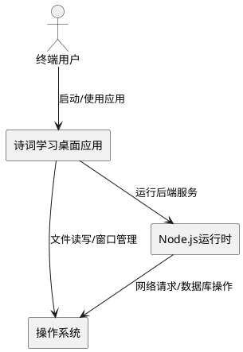
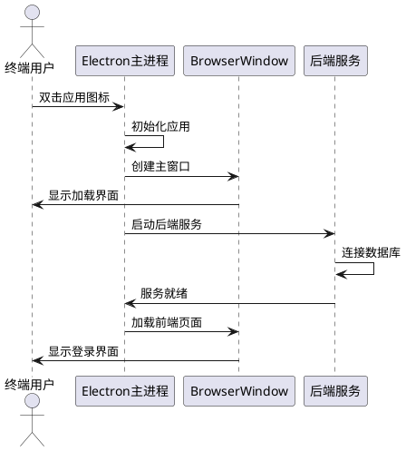
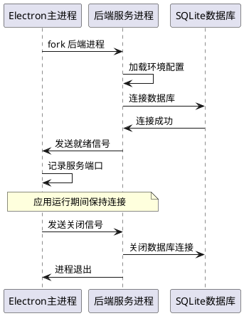
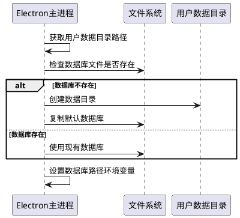
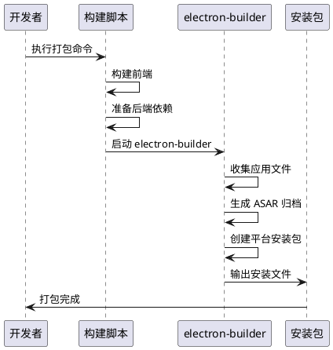

# **1. 组件定位**

## **1.1 核心职责**

本组件负责将诗词学习系统打包为独立的桌面应用程序，实现无需任何运行环境即可在 Windows/macOS/Linux 系统上安装运行。

## **1.2 核心输入**

1. 前端构建产物：Vue 3 应用编译后的静态文件
2. 后端服务代码：Express 服务器及所有依赖
3. SQLite 数据库文件：包含诗词数据、用户数据、学习记录
4. 静态资源文件：图片、配置文件等
5. 环境配置：API 密钥、JWT 密钥等敏感信息

## **1.3 核心输出**

1. 可安装的桌面应用程序安装包（Windows .exe、macOS .dmg、Linux .AppImage）
2. 应用程序运行时的日志文件
3. 用户数据目录中的数据库和配置文件

## **1.4 职责边界**

本组件不负责：
- 修改现有前端和后端的业务逻辑
- 数据库数据的初始化和迁移（由现有后端服务处理）
- 移动端打包（已有 Capacitor 配置）
- 云端部署和服务器运维

# **2. 领域术语**

**Electron 主进程**
: Electron 应用的核心进程，负责创建窗口、管理应用生命周期、启动后端服务。

**渲染进程**
: Electron 中运行前端界面的进程，每个 BrowserWindow 对应一个渲染进程。

**预加载脚本**
: 在渲染进程加载网页之前运行的脚本，用于安全地暴露 Node.js API 给前端。

**ASAR 打包**
: Electron 的归档格式，将应用文件打包为单个 .asar 文件以提高读取效率。

**用户数据目录**
: 操作系统为应用分配的持久化存储目录，用于存放数据库、日志、配置等用户数据。

# **3. 角色与边界**

## **3.1 核心角色**

终端用户：在本地计算机上安装和使用诗词学习桌面应用的用户，无需具备任何技术背景。

## **3.2 外部系统**

操作系统：提供文件系统、进程管理、网络等基础能力。

Node.js 运行时：Electron 内置的 Node.js 环境，用于运行后端服务。

## **3.3 交互上下文**

# **4. DFX约束**

## **4.1 性能**

1. 应用启动时间应小于 5 秒（从点击图标到显示登录界面）
2. 后端服务启动时间应小于 3 秒
3. 安装包体积应小于 500MB（含所有依赖和数据）

## **4.2 可靠性**

1. 应用异常退出后，用户数据不得丢失
2. 后端服务崩溃时，应用应显示错误提示并提供重启选项
3. 数据库文件损坏时，应用应提示用户并提供修复或重置选项

## **4.3 安全性**

1. 敏感配置（API 密钥、JWT 密钥）不得明文存储在代码中
2. 数据库文件应存储在用户数据目录，而非应用安装目录
3. 预加载脚本应使用 contextBridge 安全暴露 API

## **4.4 可维护性**

1. 应用应输出结构化日志，便于问题排查
2. 打包配置应支持多平台构建
3. 应提供开发模式和生产模式的区分配置

## **4.5 兼容性**

1. 支持 Windows 10/11、macOS 10.15+、主流 Linux 发行版
2. 支持 x64 和 arm64 架构
3. 安装包应包含自动更新能力（可选）

# **5. 核心能力**

## **5.1 应用启动与窗口管理**

### **5.1.1 业务规则**

1. **应用启动规则**：应用启动时必须先初始化 Electron 主进程，然后创建主窗口，最后启动后端服务。

   a. 验收条件：[用户双击应用图标] → [显示加载界面 → 启动后端服务 → 显示登录界面]

2. **窗口创建规则**：主窗口必须设置合适的尺寸、标题、图标，并禁用默认菜单栏。

   a. 验收条件：[应用启动完成] → [窗口尺寸为 1280x800，标题为"诗词学习系统"，显示自定义标题栏]

3. **窗口控制规则**：前端通过预加载脚本暴露的 API 控制窗口的最小化、最大化、关闭操作。

   a. 验收条件：[用户点击标题栏按钮] → [窗口执行对应操作]

4. **禁止项**：禁止在渲染进程中直接使用 Node.js API。

   a. 验收条件：[前端代码调用 window.electronAPI] → [通过 contextBridge 安全访问]

### **5.1.2 交互流程**

### **5.1.3 异常场景**

1. **后端服务启动失败**

   a. 触发条件：[端口被占用 或 数据库连接失败]

   b. 系统行为：[记录错误日志，尝试使用备用端口]

   c. 用户感知：[显示"服务启动失败，正在重试..."提示]

2. **窗口创建失败**

   a. 触发条件：[系统资源不足 或 显卡驱动不兼容]

   b. 系统行为：[记录错误日志，退出应用]

   c. 用户感知：[显示"应用初始化失败"错误对话框]

## **5.2 后端服务集成**

### **5.2.1 业务规则**

1. **服务启动规则**：后端服务必须在 Electron 主进程中作为子进程启动，监听本地端口。

   a. 验收条件：[应用启动] → [后端服务监听 localhost:3000]

2. **端口管理规则**：如果默认端口 3000 被占用，必须自动尝试其他可用端口。

   a. 验收条件：[端口 3000 被占用] → [自动使用端口 3001 并通知前端]

3. **服务生命周期规则**：应用关闭时必须先优雅关闭后端服务，再退出 Electron。

   a. 验收条件：[用户关闭应用] → [后端服务关闭数据库连接 → 退出进程]

4. **禁止项**：禁止后端服务监听外部网络接口。

   a. 验收条件：[后端服务启动] → [仅监听 127.0.0.1]

### **5.2.2 交互流程**

### **5.2.3 异常场景**

1. **数据库文件缺失**

   a. 触发条件：[首次启动 且 数据库文件不存在]

   b. 系统行为：[创建空数据库，提示用户导入数据]

   c. 用户感知：[显示"数据库初始化中..."提示]

2. **服务进程崩溃**

   a. 触发条件：[后端服务遇到未捕获异常]

   b. 系统行为：[记录崩溃日志，自动重启服务]

   c. 用户感知：[显示"服务异常，正在恢复..."提示]

## **5.3 数据与资源管理**

### **5.3.1 业务规则**

1. **数据库存储规则**：数据库文件必须存储在用户数据目录，而非应用安装目录。

   a. 验收条件：[应用安装] → [数据库位于 %APPDATA%/chinese-poetry/data/]

2. **资源打包规则**：静态资源（图片、配置）应打包在 ASAR 归档中，数据库文件应排除在 ASAR 外。

   a. 验收条件：[打包完成] → [静态资源在 app.asar 中，数据库在外部]

3. **路径处理规则**：应用必须正确处理开发环境和生产环境的路径差异。

   a. 验收条件：[开发模式] → [使用项目目录路径]；[生产模式] → [使用打包后路径]

4. **禁止项**：禁止将用户数据存储在应用安装目录。

   a. 验收条件：[应用卸载] → [用户数据保留在用户数据目录]

### **5.3.2 交互流程**

### **5.3.3 异常场景**

1. **用户数据目录无写入权限**

   a. 触发条件：[操作系统权限限制]

   b. 系统行为：[尝试使用备用目录，记录警告日志]

   c. 用户感知：[显示"数据存储位置已更改"提示]

2. **数据库文件损坏**

   a. 触发条件：[文件校验失败]

   b. 系统行为：[备份损坏文件，创建新数据库]

   c. 用户感知：[显示"数据库已重置，请重新导入数据"提示]

## **5.4 打包与分发**

### **5.4.1 业务规则**

1. **打包配置规则**：必须使用 electron-builder 进行打包，支持多平台配置。

   a. 验收条件：[执行打包命令] → [生成 Windows/macOS/Linux 安装包]

2. **依赖打包规则**：所有 Node.js 依赖必须完整打包，包括 native 模块。

   a. 验收条件：[安装包安装] → [无需安装额外依赖即可运行]

3. **版本管理规则**：安装包必须包含版本号，支持版本识别。

   a. 验收条件：[查看应用属性] → [显示版本号信息]

4. **禁止项**：禁止打包开发依赖（如 vite、eslint）到生产安装包。

   a. 验收条件：[安装包体积] → [小于 500MB]

### **5.4.2 交互流程**

### **5.4.3 异常场景**

1. **Native 模块编译失败**

   a. 触发条件：[sqlite3 等模块缺少编译环境]

   b. 系统行为：[使用预编译版本 或 提示安装编译工具]

   c. 用户感知：[显示"打包失败，请检查编译环境"错误]

2. **打包体积超限**

   a. 触发条件：[安装包超过 500MB]

   b. 系统行为：[分析体积构成，提示优化建议]

   c. 用户感知：[显示"打包体积过大"警告]

# **6. 数据约束**

## **6.1 应用配置**

1. **应用名称**：诗词学习系统，用于窗口标题和安装目录名

2. **应用 ID**：com.chinese-poetry.app，用于操作系统识别应用

3. **默认端口**：3000，后端服务默认监听端口

4. **窗口尺寸**：1280x800 像素，默认窗口大小

## **6.2 打包配置**

1. **目标平台**：Windows (nsis)、macOS (dmg)、Linux (AppImage)

2. **输出目录**：release/，安装包输出位置

3. **ASAR 排除项**：数据库文件 (*.db)、日志文件 (*.log)

4. **额外资源**：poetry/ 目录（诗词 JSON 数据，可选）
